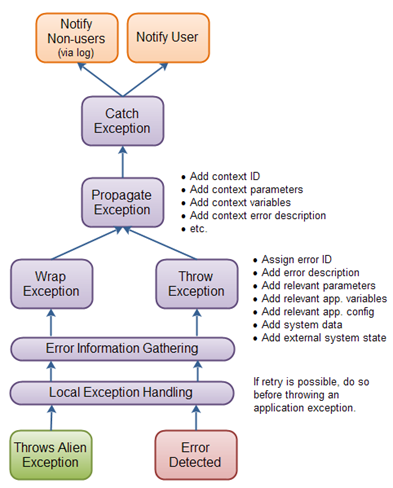
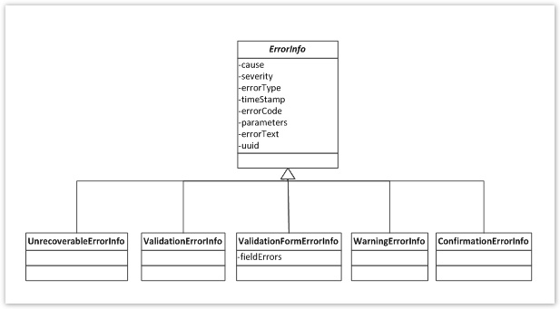

# exception-definition
An exception hierarchy definition.

## Exception handling strategy

An exception handling strategy consists of all actions and conventions necessary to properly handle exceptions in your application. It typically consists of the following elements:

1. Error detection.
2. Error information gathering.
3. Throwing and propagating the exception.
4. Catching and reacting to the exception: Notifying relevant parties.



### Error detection
Error detection is what your code does to detect an error, preferably before the error happens. For instance, you validate input parameters in a method, before using them.
At this point, you try local exception handling if possible. This is where you e.g. send your request to a backup server or wait X seconds and try again, etc. You do what you can, if anything, to handle the error and continue whatever operation your application was currently carrying out.
If there is no way of handling the problem locally, proceed to point 2.

### Error information gathering
Gather all the information necessary to diagnose, reproduce and report the error.
Now we should think about who must be notified about the error and how to provide them with all the important information in order to determine if and how to respond to the error, and whether the error is severe or not. 

Application end users, operators, administrators and developers typically need information about what caused the error.
The developers also need to know the location of the error. Knowing the location of the error is essential to know where to start looking for the cause of the error.

Exactly what information you need to collect and who should be notified depends on the kind of error detected: i.e. an error produced by a form validation probably should only be notified to the user as it does not mean the application is not working properly.

| Cause                                             | Interested Party                                     |
|---------------------------------------------------|------------------------------------------------------|
| Technical error description                       | Developers, Operators / Administrators               |
| End user error description                        | End Users                                            |
| Severity                                          | End Users, Developers, Operators / Administrators    |
| Relevant external conditions (is system X up?).   | End Users, Developers, Operators / Administrators    |
| Error Type                                        | Developers, Operators / Administrators               |
------------------------------------------------------------------------------------------------------------
                                                      

| Location                 | Interested Party                                |
|--------------------------|-------------------------------------------------|
| Stack Trace              | Developers                                      |
| Unique Error ID          | Developers, Operators / Administrators          |
| Time stamp               | Developers, Operators / Administrators          |
------------------------------------------------------------------------------

This information is encapsulated in the ErrorInfo abstract class that can be instantiated through several specialized classes as described in the diagram below:




- **UnrecoverableErrorInfo**: An unrecoverable error should be raised from any layer of the application when the user can do nothing in order to fix the error detected (i.e. a Web Service call failed because the service is down). It could be also used if there is not enough contextual information in order to decide what the meaning of the error for the user is. For instance, an exception performing a DB operation in the persistence layer that probably will be wrapped and re-thrown in upper layers as a ValidationErrorInfo.                
- **ValidationErrorInfo**: Generic validation errors raised from any layer but typically for business validations (i.e. it is not possible to change the milestone of the dossier because is appealed).
- **ValidationFormErrorInfo**: Validation errors generated from the presentation layer (i.e. validation of a form or input parameters).
- **WarningErrorInfo**: Warning messages that must be shown to the user.
- **ConfirmationErrorInfo**: Operations that must be confirmed by the 
   
   
The ErrorInfo instances can potentially contain the following attributes:

- **cause**: Throwable. The error cause, if an alien or another application exception is caught and wrapped. This object contains the stacktrace of the exception.
- **severity**: Severity. The severity of the error. Up to now used to establish the level of the logger (OFF, DEBUG, INFO, WARN, ERROR).
- **errorType**: ErrorType. Tells whether the error was caused by erroneous input to the application, an external service that failed, or an internal error (UNRECOVERABLE, VALIDATION, VALIDATION_FORM, WARNING, CONFIRMATION).
- **timestamp**: Date. The time stamp when the exception was created.
- **errorText**: String. Contains a description of the error with all the necessary details needed for the application operators, and possibly the application developers, to understand what error occurred.
- **errorCode**: MessageCodesBundle. Key used to lookup an error message in a text bundle, so the user can get the error description in his or her own language. There will be several implementing enums with message codes (GeneralMessages, FeeMesssages, IoFMessages, etc). Every external component should define its own implementation of MessageCodesBundle and manage its own message properties file.
- **parameters**: Object[]. Any additional parameters needed to construct a meaningful error description for the user.
- **uuid**: String. An autogenerated universally unique identifier.

### Throwing and propagating the exception

At this level you convert the caught exception, or the error detected, into an application specific exception, and throw it. You should add any information necessary to properly handle the exception. When an exceptio

- **Passive Propagation**: Passive propagation means that you just let the exception pass up the call stack without catching it. For this to be possible the exception must of course be declared by the method propagating it, or the exception must be unchecked.
- **Active Propagation**: Active propagation means that you catch the exception and rethrow it, or wrap it in a new exception. You will typically use active propagation when you need to add extra information to the exception, about what actions were attempted and with what data, when the exception occurred. In other words, you need to catch the exception in various relevant locations on the way up the call stack, and add the relevant context information to it, before rethrowing or wrapping it.


#### Rethrowing vs. Wrapping Exceptions
                             
Propagation can be implemented by either rethrowing the original exception or wrapping it in a new exception.


#### Propagating a wrapped exception
```java
public void doSomething() {
    try {
        doSomethingThatCanThrowException();
    } catch(SomeException e) {
        // Propagation
        throw new WrappingException(e, "more info...");
    }        
    finally {
        // clean up, close open resources, etc
    }
    return value;
}
```

#### Rethrowing an exception  
```java
public void doSomething() {
    try {
        doSomethingThatCanThrowException();
    } catch(SomeException e) {
        // Propagation
        e.addContextInformation("more info");
        throw e;
    }        
    finally {
        // clean up, close open resources, etc
    }
    return value;
}  
```                                                   

- **For alien exceptions (an exception thrown by a Java API or a third party library)**: Catch the checked alien exception and wrap it into an ApplicationException. Chose the proper ErrorInfo implementation and provide it with a descriptive message. Then you can throw it in order to perform the propagation to the next layer. 
If the alien exception is unchecked, you should proceed in the same manner but only if you want to provide a different meaning for it. Otherwise, let it propagate to the upper layer.

- **For application exceptions (i.e. ApplicationException)**:  If there is not a fall-back strategy defined, you should only catch them if you can provide further information about the context (additional parameters or a more accurate description of what produced the error). Otherwise, let them propagate through the call stack. When wrapping an exception, it automatically stacks up the new ErrorInfo object into the internal stack so the original cause is preser


### Exception hierarchy

The exception hierarchy consists only of two unchecked application exceptions:

 - **ApplicationException**:  This unckecked exception will be generally used in order to raise an application exception. It does not provide any additional behaviour than the BaseException and it will produce a rollback operation when it is raised out of a transactional context.
 - **NoRollbackException**: The transaction manager will be configured in order not to perform a rollback operation when this exception is raised.
 
 
### Catching exceptions
Somewhere in your application you need to catch and react to thrown exceptions. Typically you will do this towards the top of the call hierarchy. For instance, in a web application you may catch exceptions in the control servlet (if you have a control servlet).

#### Exception Reactions
     
When the exception reaches the top level catch clause, it should be notified to the users and non-users.

- **Notifying Users**: How you notify the user depends on what kind of application you are developing. I.e. a REST service notifies the use (a web service client) by a XML/JSON fault elem
- **Notifying non-users**: Non-users are typically notified via the application log. Exactly what kind of severity to log the exception under, depends on the type of ErrorInfo used. 

<p style="color:red">As a general rule we should NOT log any exception if it is handled and re-thrown. This will avoid duplicated log traces and will make the log files easier to understand.</p>

### Example of use

Let's see a practical example of how to apply the strategy in a multi layered application. 
We have the following DAO in the Persistence Layer:


```java
public class JpaInspectionFileDao extends JpaIptoolModelAbstractDao implements InspectionFileDao {
    @Override
    public InspectionFile create(InspectionFile iof) {
        getEntityManager().persist(iof);
        throw iof;
    }
 
    @Override
    public InspectionFile read(long id) {
        return getEntityManager().find(InspectionFile.class, Long.valueOf(id));
    } 
```  

Suppose we decided to control the behavior of the application when the user tries to create a new IoF dossier and we want to report him with a friendly message: The Key-in could not be performed as the IoF dossier '00012232' already exists.

At this point, we have several alternatives: 
1. Catch the JPA EntityExistsException (alien exception) in the persistence layer, wrap and propagate it as an application exception (IPToolException). 
2. Check for the existence of the IoF dossier within a higher layer (i.e. business layer) and raise an application exception.

##### Option 1:

We should catch the EntityExistsException since this exception belongs to the persistence layer and must not be propagated to a higher layer. Once the exception is caught, we can wrap it as an IPToolException and prop

```java
@Override
public InspectionFile create(InspectionFile iof) {
    try {
        getEntityManager().persist(iof);
    } catch (EntityExistsException e) {
        String error = String.format("Persistence Exception: The IoF dossier %s already exists", iofEntity.getId());
        throw new ApplicationException(e, new UnrecoverableErrorInfo(error, GeneralMessages.PERSISTENCE_LAYER_FAILED));
    }
}
```

Notice how the EntityExistsException instance is the first parameter for the constructor. This will preserve the stack trace of the original cause. The second parameter is the ErrorInfo object. In that case we chose the UnrecoverableErrorInfo type as at this point it is not possible to handle the error and we delegate to the caller to handle it. 
Bear in mind that we cannot set the expected message for the user at this point as we do not have enough information about the context from which the operation is performed. In other words, we cannot define a user message here as this method could be invoked from several parts of the application with different purposes. In this case, we should consider users or clients all the possible consumers of the method. That's why we use a generic message for persistence errors: GeneralMessages.PERSISTENCE_LAYER_FAILED. 
As the exception was thrown, we can now catch it at upper layers, where the main functionality of the Key-In action is implemented. This will be typically in the business laye


```java
@Override
public void performKeyIn(InspectionFile iofEntity) {
...
    try {
        inspectionOfFilesDao.create(iofEntity);
    } catch (ApplicationException e) {
        String error = String.format("Business Exception: The IoF dossier %s already exists", iofEntity.getId());
        throw new ApplicationException(e, new ValidationErrorInfo(error, IOFMessages.KEY_IN_IOF_ALREADY_EXISTS, iofEntity.getId()));
    }
}
```


Also note the IOFMessages.KEY_IN_IOF_ALREADY_EXISTS. It is an enumeration containing all the message tokens related to IoFs dossiers making easier the internationalization of the application. This enumeration must implement the MessageCodesBundle interface and its purpose is to split the message tokens into several categories assigning a different prefix for each one. 
The token key must be defined in a messages.properties file.

The rest of parameters of the ValidationErrorInfo constructor are values to be applied to the placeholders defined within the message. 
We can now either let the exception propagate to the exception handler or catch it again at any point of the call stack in order to provide a more accurate information.


##### Option 2:

```java
@Override
public void performKeyIn(InspectionFile iofEntity) {
...
    InspectionFile checkEntity = inspectionOfFileDao.read(iofEntity.getId());
    if (checkEntity!=null) {
        String error = String.format("Business Exception: The IoF dossier %s already exists", iofEntity.getId());
        throw new ApplicationException(e, new ValidationErrorInfo(error, IOFMessages.KEY_IN_IOF_ALREADY_EXISTS, iofEntity.getId()));
    }
 
    inspectionOfFilesDao.create(iofEntity);
}
```


### Related links

- [http://www.ibm.com/developerworks/library/j-jtp05254](http://www.ibm.com/developerworks/library/j-jtp05254)
- [http://tutorials.jenkov.com/java-exception-handling/checked-or-unchecked-exceptions.html](http://tutorials.jenkov.com/java-exception-handling/checked-or-unchecked-exceptions.html)
- [http://littletutorials.com/2008/05/06/exceptional-java-checked-exceptions-are-priceless-for-everything-else-there-is-the-the-runtimeexception](http://littletutorials.com/2008/05/06/exceptional-java-checked-exceptions-are-priceless-for-everything-else-there-is-the-the-runtimeexception)
- [http://www.artima.com/designtechniques/desexcept.html](http://www.artima.com/designtechniques/desexcept.html)
- [http://www.artima.com/intv/solid.html](http://www.artima.com/intv/solid.html)
- [http://www.artima.com/intv/handcuffs.html](http://www.artima.com/intv/handcuffs.html)

